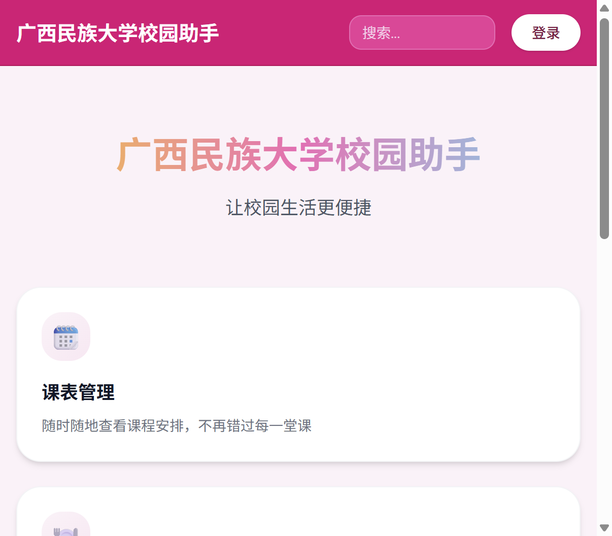
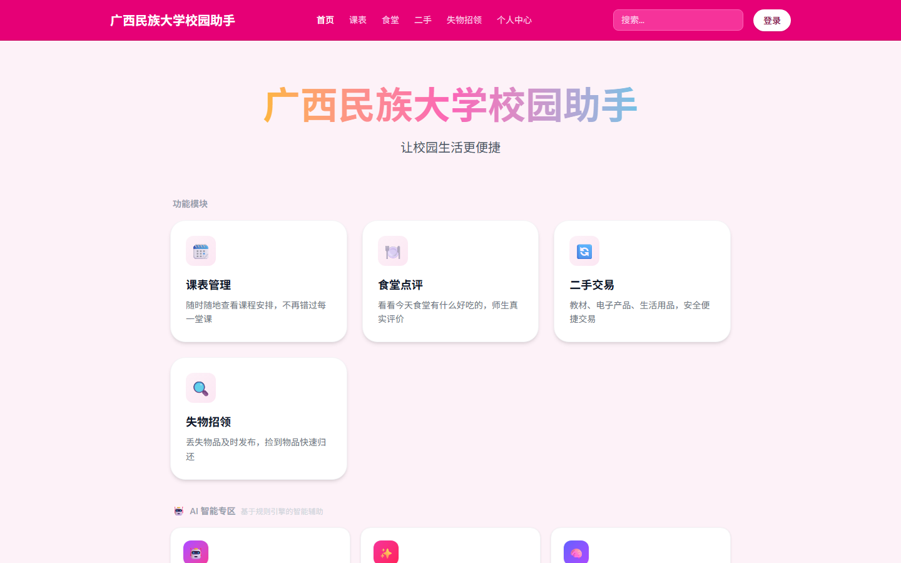
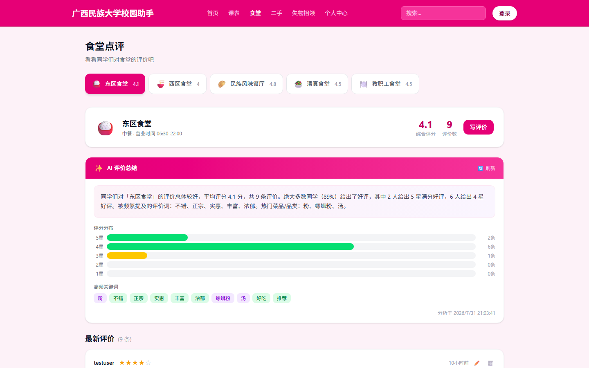
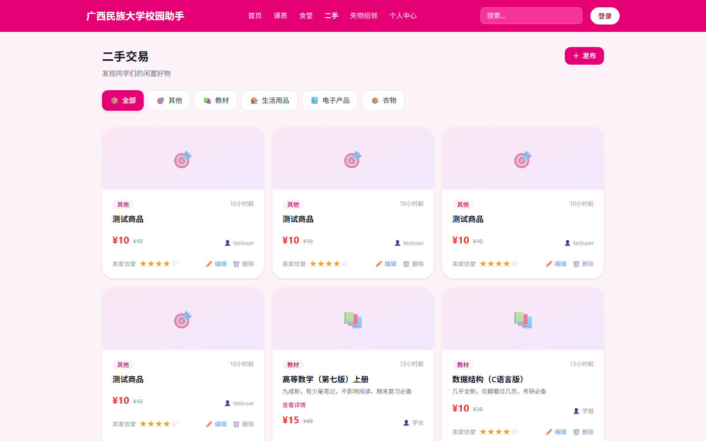
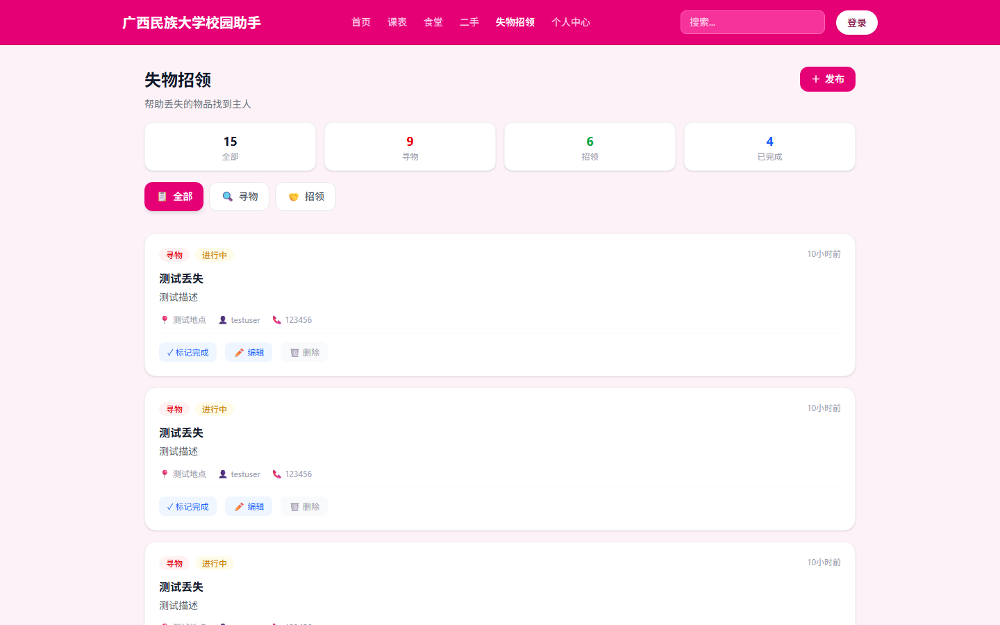
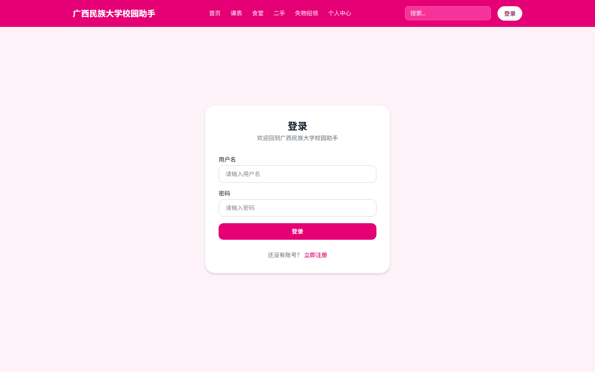
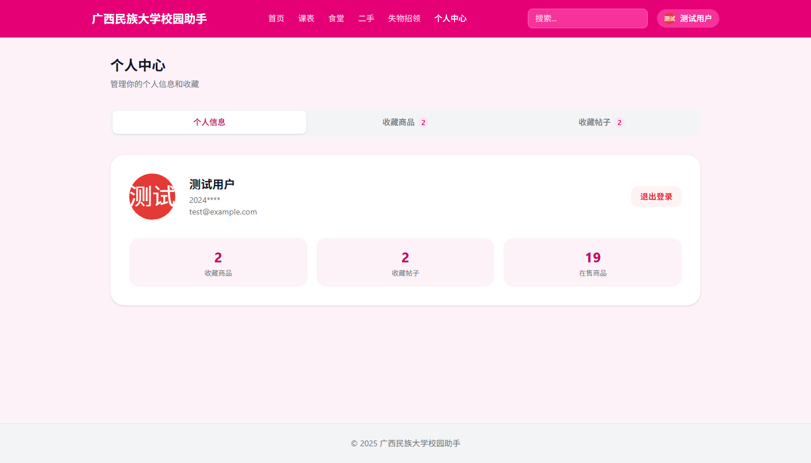

# 广西民族大学校园助手

一个面向广西民族大学师生的综合性校园服务平台，集成课表管理、食堂点评、二手交易、失物招领等核心功能，并引入 AI 智能辅助提升用户体验。



## 功能截图

### 首页

首页展示校园助手核心功能入口，包含课表管理、食堂点评、二手交易、失物招领四大模块及 AI 智能专区导航。

### 食堂点评页 + AI 总结

食堂页面展示各食堂评分、营业时间与用户评价，底部 AI 智能总结自动分析评价数据，生成评分分布、高频关键词与情感分析报告。

### 二手交易页 + AI 描述

二手交易页面支持按分类浏览与搜索校园闲置商品，发布商品时可使用 AI 描述生成功能自动创建营销文案。

### 失物招领页

失物招领页面支持发布丢失/拾获信息，可按类型筛选，配合 AI 描述生成与智能匹配功能帮助失物快速归还。

### 登录页

登录页面支持账号密码登录与注册，通过 JWT 令牌认证保护用户数据安全。

### 个人中心

个人中心展示用户信息与收藏管理，支持查看收藏商品、收藏帖子及退出登录。

## 功能列表

### 课表管理
- 按星期查看课程安排
- 课程详细信息展示（时间、地点、教师）
- 支持 12 门课程数据

### 食堂点评
- 5 个食堂信息展示（东区、西区、民族风味、清真、教职工食堂）
- 用户评价系统（17 条评价数据）
- 评分星级展示
- AI 评价总结（智能分析评分分布、高频关键词、情感分析）

### 二手交易
- 商品分类浏览（教材、电子产品、生活用品、衣物、其他）
- 商品搜索功能
- 商品发布
- AI 商品描述生成

### 失物招领
- 丢失物品发布
- 拾到物品发布
- 类型筛选（丢失/招领）
- 标记已解决
- AI 描述生成
- 智能匹配

### 作业管理
- 作业列表展示
- 作业状态管理（待提交/已提交/已批改）
- 截止日期提醒

### 用户系统
- 注册/登录（JWT 认证）
- 个人中心
- 收藏管理（商品/帖子）
- 首字母头像（颜色随机生成）

### AI 智能功能
- AI 评价总结：智能分析食堂评价数据
- AI 商品描述：根据标题自动生成营销文案
- AI 失物描述：生成寻物/招领描述
- 智能匹配：自动匹配相关物品信息

## 技术栈

### 前端
| 技术 | 说明 |
|------|------|
| React 19 | 前端框架 |
| TypeScript 6 | 类型安全 |
| Vite 8 | 构建工具 |
| Tailwind CSS 4 | CSS 框架 |
| React Router 7 | 路由管理 |

### 后端
| 技术 | 说明 |
|------|------|
| Node.js | 运行环境 |
| Express 4 | Web 框架 |
| SQLite (better-sqlite3) | 数据库 |
| JWT (jsonwebtoken) | 身份认证 |
| bcryptjs | 密码加密 |
| express-validator | 参数校验 |

## 部署链接

- **线上访问地址（推荐）**：[https://campus-assistant-production-1dfb.up.railway.app](https://campus-assistant-production-1dfb.up.railway.app)
- **前端（Vercel）**：[https://my-react-app-kappa-opal.vercel.app](https://my-react-app-kappa-opal.vercel.app)
- **后端 API 健康检查**：[https://campus-assistant-production-1dfb.up.railway.app/health](https://campus-assistant-production-1dfb.up.railway.app/health)

### 测试账号
| 用户名 | 密码 | 说明 |
|--------|------|------|
| testuser | 123456 | 普通测试用户 |
| admin | 123456 | 管理员 |
| zhangsan | 123456 | 演示用户 |
| lisi | 123456 | 演示用户 |

## 本地运行方法

### 环境要求
- Node.js >= 18
- npm >= 9

### 1. 克隆项目

```bash
git clone https://github.com/momo-822/campus-assistant.git
cd campus-assistant
```

### 2. 启动后端服务

```bash
cd server
npm install
node app.js
```

后端服务默认运行在 `http://localhost:3001`

### 3. 启动前端开发服务器

新开一个终端：

```bash
cd my-react-app
npm install
npm run dev
```

前端开发服务器默认运行在 `http://localhost:5173`

### 4. 访问应用

打开浏览器访问 `http://localhost:5173` 即可使用完整功能。

### 5. 构建生产版本

```bash
cd my-react-app
npm run build
```

构建产物位于 `dist/` 目录，可直接部署到静态服务器。

## 项目结构

```
my-react-app/
├── src/                      # 前端源码
│   ├── api/                  # API 接口封装
│   ├── components/           # 公共组件
│   ├── context/              # React Context 状态管理
│   ├── hooks/                # 自定义 Hooks
│   ├── mock/                 # 模拟数据
│   ├── pages/                # 页面组件
│   ├── App.tsx               # 路由配置
│   └── main.tsx              # 入口文件
├── server/                   # 后端服务
│   ├── config/               # 数据库配置
│   ├── controllers/          # 控制器
│   ├── middleware/            # 中间件
│   ├── routes/               # 路由
│   ├── utils/                # 工具函数
│   └── app.js                # 服务入口
├── public/                   # 静态资源
├── index.html                # HTML 入口
├── vite.config.ts            # Vite 配置
├── package.json              # 前端依赖
└── README.md                 # 项目说明
```

## 许可证

MIT License